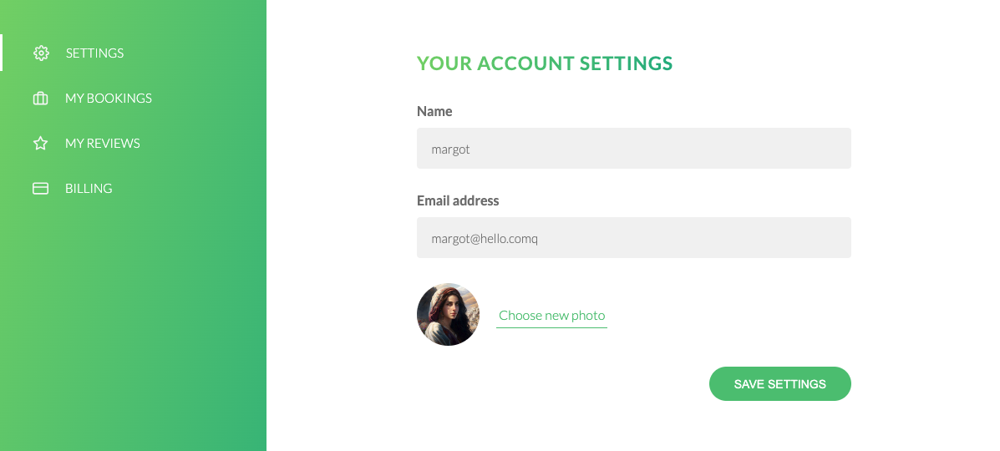

# Natours

Natours offers a range of adventure tours. It's designed for a user-friendly experience in exploring and booking tours. Check it out: https://tours-chao.herokuapp.com/

## Features

- **User Account Management**: Features include user registration, secure login, authorization, password reset functionality, and the ability to customize profile pictures.
  
- **Tour Exploration and Booking**: Offers a diverse selection of adventure tours, each with comprehensive details. The interface is visually appealing and intuitive, enhancing user navigation.
  - **Interactive Maps**: Each tour displays its route on an interactive map, providing a clear overview of the journey.
    
  - **Booking and Payment**: Users can easily book their chosen tour and complete payments securely online.
    
  - **reviews and bookings management**: Allows users to manage their bookings and reviews.
    

## Technologies Used

- **Node.js**: Server-side JavaScript execution.
- **Express**: Web application framework for routing and middleware.
- **MongoDB**: Database to store tours, users, bookings, and reviews
- **JSON Web Tokens (JWT)**: For secure user authentication and maintaining sessions.
- **Pug**: Server-side template engine to render HTML based on dynamic data.
- **Mapbox API**: To display interactive maps for tour routes.
- **Multer**: Middleware for uploading files.
- **SendGrid**: Email delivery service for sending notifications and confirmations.
- **Stripe API**: For processing secure online payments for tour bookings.
- **Heroku**: Platform for deploying and hosting the application.
- …

## Acknowledgments

thanks to [Node.js, Express, MongoDB & More: The Complete Bootcamp 2024](https://www.udemy.com/course/nodejs-express-mongodb-bootcamp/)
